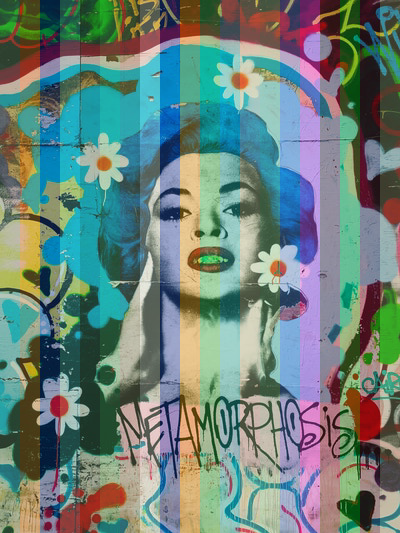

# noops-challenge

## Hexbot

My first attempt at playing with images and Go.
Roamed around for a while and decided to go for color strips on a random image given by unplashed. A random result was:

Photo by [Jon Tyson](https://unsplash.com/@jontyson?utm_source=noops_challenge&utm_medium=referral) on [Unsplash](https://unsplash.com/?utm_source=noops_challenge&utm_medium=referral) modified with a color given by [Hexbot](https://noopschallenge.com/challenges/hexbot).
